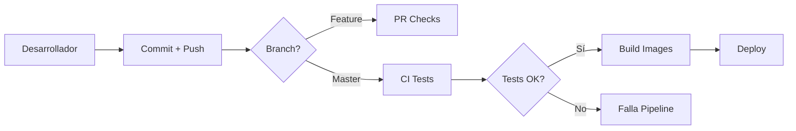

# CI/CD - Integración y Despliegue Continuo

Este documento explica la configuración de CI/CD implementada para el proyecto Arka utilizando GitHub Actions.

## 📋 Tabla de Contenidos

- [Workflows Implementados](#workflows-implementados)
- [Flujo de Trabajo](#flujo-de-trabajo)
- [Configuración de GitHub](#configuración-de-github)
- [Ejecución Local](#ejecución-local)
- [Troubleshooting](#troubleshooting)

---

## 🔄 Workflows Implementados

### 1. CI - Tests y Cobertura (`ci-tests.yml`)

**Propósito**: Ejecutar tests automáticamente en cada push o pull request.

**Triggers**:
- Push a `master`, `main` o `develop`
- Pull requests a `master`, `main` o `develop`
- Solo cuando hay cambios en `arka-microservicios/**`

**Características**:
- ✅ Ejecución paralela de tests por servicio
- ✅ Detección inteligente de cambios (solo ejecuta tests de servicios modificados)
- ✅ Verificación de cobertura mínima del 70%
- ✅ Reportes de cobertura con Codecov
- ✅ Publicación de resultados de tests
- ✅ Job final que verifica que todos los tests pasaron

**Servicios incluidos** (11 servicios):
- product-service
- customer-service
- inventory-service
- order-service
- cart-service
- notification-service
- report-service
- auth-server
- api-gateway
- config-server
- eureka-server

**Ejemplo de ejecución**:
```yaml
# Detecta cambios en product-service
# Ejecuta solo los tests de product-service
# Genera reporte de cobertura
# Sube a Codecov
# Publica resultados
```

---

### 2. CD - Build Docker Images (`cd-build-images.yml`)

**Propósito**: Construir y publicar imágenes Docker cuando los tests pasan.

**Triggers**:
- Push a `master` o `main`
- Después de que el workflow `CI - Tests y Cobertura` se complete exitosamente

**Características**:
- ✅ Solo se ejecuta si los tests pasaron
- ✅ Build paralelo de todas las imágenes Docker
- ✅ Publicación en GitHub Container Registry (ghcr.io)
- ✅ Tagging automático:
  - `latest` para rama principal
  - `<branch>-<sha>` para identificación única
  - `<branch>` para última versión de rama

**Registry**: `ghcr.io/<usuario>/arka-<servicio>`

**Ejemplo de tags**:
```
ghcr.io/usuario/arka-product-service:latest
ghcr.io/usuario/arka-product-service:master
ghcr.io/usuario/arka-product-service:master-abc1234
```

---

### 3. PR - Validaciones y Cobertura (`pr-checks.yml`)

**Propósito**: Validaciones específicas para Pull Requests.

**Triggers**:
- Pull requests a `master`, `main` o `develop`

**Características**:
- ✅ Validación de calidad de código
- ✅ Tests solo de servicios modificados
- ✅ Comentarios automáticos con cobertura en la PR
- ✅ Resumen de validaciones
- ✅ Verificación de umbral de cobertura (70%)
- ✅ Cancelación automática de ejecuciones anteriores si se hace nuevo push

**Ejemplo de comentario automático**:
```
✅ Cobertura de inventory-service: 78.5% (mínimo: 70%)
```

---

## 🔀 Flujo de Trabajo

### Desarrollo Normal



### Pull Request

```
1. Desarrollador crea PR
   ↓
2. GitHub Actions ejecuta pr-checks.yml
   ↓
3. Detecta servicios modificados
   ↓
4. Ejecuta solo tests de servicios modificados
   ↓
5. Genera reportes de cobertura
   ↓
6. Comenta automáticamente en la PR
   ↓
7. Verifica umbral de 70%
   ↓
8. ✅ Aprobado o ❌ Requiere correcciones
```

### Merge a Master

```
1. PR aprobado y mergeado
   ↓
2. GitHub Actions ejecuta ci-tests.yml
   ↓
3. Ejecuta TODOS los tests en paralelo
   ↓
4. Verifica cobertura de todos los servicios
   ↓
5. Si pasa → Trigger cd-build-images.yml
   ↓
6. Build paralelo de imágenes Docker
   ↓
7. Push a ghcr.io
   ↓
8. ✅ Listo para deploy
```

---

## ⚙️ Configuración de GitHub

### 1. Habilitar GitHub Actions

1. Ve a tu repositorio en GitHub
2. Settings → Actions → General
3. Selecciona "Allow all actions and reusable workflows"
4. Habilita "Read and write permissions" para GITHUB_TOKEN

### 2. Configurar Secrets (Opcional)

Para Codecov (opcional):
```bash
# Settings → Secrets and variables → Actions → New repository secret
CODECOV_TOKEN=<tu-token>
```

### 3. Habilitar GitHub Packages

1. Settings → Packages
2. Asegúrate de tener permisos de escritura
3. Las imágenes se publicarán en `ghcr.io/<tu-usuario>/arka-*`

### 4. Branch Protection Rules (Recomendado)

```
Settings → Branches → Add branch protection rule

Branch name pattern: master (o main)

☑ Require status checks to pass before merging
  ☑ Require branches to be up to date before merging
  Status checks required:
    - test-product-service
    - test-customer-service
    - test-inventory-service
    - test-order-service
    - test-cart-service
    - test-notification-service
    - test-report-service
    - test-auth-server

☑ Require pull request reviews before merging
  - Required approvals: 1

☑ Include administrators
```

---

## 💻 Ejecución Local

### Ejecutar Tests Localmente

```bash
# Test individual de un servicio
cd arka-microservicios/product-service
./gradlew test jacocoTestReport

# Ver reporte de cobertura
# Abre: build/reports/jacoco/test/html/index.html

# Verificar umbral de cobertura
./gradlew jacocoTestCoverageVerification
```

### Ejecutar Tests de Todos los Servicios

```bash
# Script para ejecutar todos los tests
for service in product-service customer-service inventory-service order-service cart-service notification-service report-service auth-server api-gateway config-server eureka-server; do
  echo "Testing $service..."
  cd arka-microservicios/$service
  ./gradlew test --no-daemon
  cd ../..
done
```

### Simular CI Localmente con Act

```bash
# Instalar act (https://github.com/nektos/act)
# macOS
brew install act

# Linux
curl https://raw.githubusercontent.com/nektos/act/master/install.sh | sudo bash

# Windows
choco install act-cli

# Ejecutar workflow localmente
act push -W .github/workflows/ci-tests.yml

# Ejecutar solo un job específico
act push -j test-product-service
```

---

## 🐛 Troubleshooting

### Tests Fallan en CI pero Pasan Localmente

**Problema**: Tests pasan localmente pero fallan en GitHub Actions.

**Solución**:
```bash
# Verificar que Testcontainers funciona
docker ps  # Debe estar corriendo Docker

# Limpiar cache de Gradle
./gradlew clean test --no-daemon

# Verificar permisos de gradlew
chmod +x gradlew
```

### Cobertura Insuficiente

**Problema**: El pipeline falla con "Coverage verification failed".

**Solución**:
```bash
# Ver reporte detallado de cobertura
./gradlew jacocoTestReport
open build/reports/jacoco/test/html/index.html

# Identificar clases sin cobertura
# Agregar tests para clases críticas
# Las clases excluidas están en build.gradle:
# - *Application.class
# - *Config*.class
# - dto/**
# - model/**
# - mapper/**
```

### Build de Imagen Docker Falla

**Problema**: El workflow de CD falla al construir imágenes.

**Solución**:
```bash
# Verificar que el Dockerfile existe
ls arka-microservicios/product-service/Dockerfile

# Verificar que el JAR se construye correctamente
cd arka-microservicios/product-service
./gradlew bootJar
ls build/libs/*.jar

# Probar build local
docker build -t test-image .
```

### Workflow No Se Ejecuta

**Problema**: El workflow no se ejecuta automáticamente.

**Verificar**:
1. Los archivos están en `.github/workflows/`
2. El formato YAML es correcto (usa un linter)
3. GitHub Actions está habilitado en el repositorio
4. El trigger `paths` coincide con tus cambios

```bash
# Validar YAML
yamllint .github/workflows/ci-tests.yml

# Forzar ejecución manual
# GitHub → Actions → Select workflow → Run workflow
```

---

## 📊 Métricas y Monitoreo

### Ver Resultados en GitHub

1. **Actions Tab**: Ve a la pestaña Actions en tu repositorio
2. **Workflow Runs**: Lista de todas las ejecuciones
3. **Details**: Click en una ejecución para ver detalles
4. **Logs**: Logs detallados de cada job

### Badges de Estado

Agrega badges a tu README.md:

```markdown


[](https://codecov.io/gh/<usuario>/<repo>)
```

### Codecov Dashboard

Si configuraste Codecov:
- Dashboard: `https://codecov.io/gh/<usuario>/<repo>`
- Reportes por servicio
- Tendencias de cobertura
- Cobertura por archivo

---

## 🎯 Mejores Prácticas

### 1. Commits y Mensajes

```bash
# Buenos commits
git commit -m "feat: agregar endpoint de cancelación de orden"
git commit -m "fix: corregir optimistic locking en inventory"
git commit -m "test: agregar tests de concurrencia para inventory"

# Evitar commits genéricos
git commit -m "cambios"
git commit -m "wip"
```

### 2. Pull Requests

- **Tamaño**: Mantén las PRs pequeñas (<500 líneas)
- **Descripción**: Explica qué cambios haces y por qué
- **Tests**: Agrega tests para nuevas funcionalidades
- **Cobertura**: Asegúrate de mantener al menos 70%

### 3. Tests

```java
// ✅ Buenos nombres de tests
@Test
void shouldReserveStockSuccessfully() { ... }

@Test
void shouldThrowExceptionWhenInsufficientStock() { ... }

// ❌ Malos nombres
@Test
void test1() { ... }

@Test
void testReserve() { ... }
```

### 4. Gestión de Ramas

```
master/main    → Producción (protegida)
develop        → Desarrollo (protegida)
feature/xyz    → Nuevas funcionalidades
bugfix/xyz     → Correcciones de bugs
hotfix/xyz     → Correcciones urgentes
```

---

## 📚 Referencias

- [GitHub Actions Documentation](https://docs.github.com/en/actions)
- [Testcontainers Documentation](https://www.testcontainers.org/)
- [JaCoCo Documentation](https://www.jacoco.org/jacoco/trunk/doc/)
- [Codecov Documentation](https://docs.codecov.com/)
- [Docker Build Push Action](https://github.com/docker/build-push-action)

---

## 🤝 Contribuir

Para contribuir al proyecto:

1. Fork el repositorio
2. Crea una rama feature (`git checkout -b feature/nueva-funcionalidad`)
3. Commit tus cambios (`git commit -m 'feat: agregar nueva funcionalidad'`)
4. Push a la rama (`git push origin feature/nueva-funcionalidad`)
5. Abre un Pull Request
6. Espera las validaciones automáticas
7. Solicita revisión de código

---

**Última actualización**: 2025-01-18
**Versión**: 1.0.0